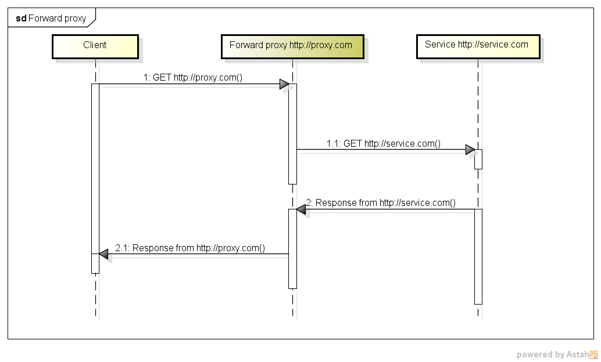
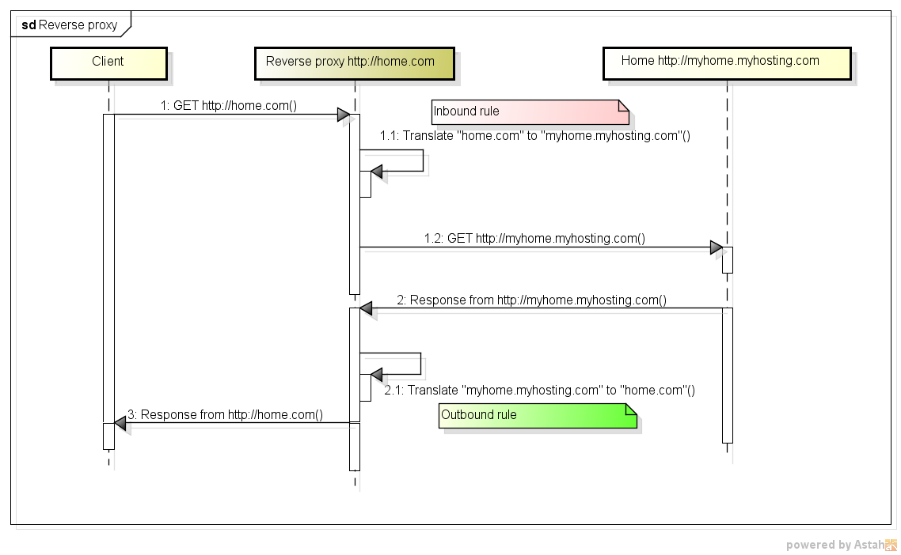

## Nginx -- 代理工具

nginx可以用作正向代理，也可以用作反向代理。用nginx作为正向代理有个缺点：

- 只能代理http请求，https或者socket不可以；

所以一般情况下，用nginx作反向代理比较多，正向代理一般用squid3做比较好。

## 正向代理和反向代理的区别

1. 正向代理对于客户端是可见的，你要上网，必需先配置代理服务器；
2. 反向代理对于客户端不可见，你访问的某个网站，实际处理和返回结果的服务器可能并不是你想象的那样；





## 使用反向代理的目的

一个是`安全性`，另外一个是`负载均衡`。

### 负载均衡
比如：我现在有一个java web应用，使用tomcat提供对外提供服务。如果只有一个tomcat实例，最大同时可以处理200个用户的请求，超过这个极限值，服务器就挂了。为了扩展，我增加了另外2台同样的tomcat，这样理论上可以支持400个用户的访问请求了。
看看我们怎么去处理这样的问题。

#### 方法一 DNS轮询

DNS可以把域名解析为IP地址，如果我们在DNS上注册的时候，把域名解析为多个IP，是不是就可以了呢？答案是可行的，但是这种方案有缺陷。

1. 应用依赖于DNS，DNS并不是立刻生效，需要同步一定的时间后，新加入的服务器才能对外提供服务，一般需要几个小时；

2. DNS是随机解析，你并不能控制最终用户被解析到哪台服务器上，即使这台服务器的负载已经很高了；

#### 方法二 反向代理

```shell
http {
    upstream backend {
        server backend1.example.com weight=5;
        server backend2.example.com;
        server 192.0.0.1 backup;
    }

	server {
	    location / {
	        proxy_pass http://backend;
	    }
	}
}
```

当用户的请求进来后，访问`/`，那么server就会根据location的配置进行处理。nginx通过proxy_pass将请求转发到backend服务器，因为服务器一共有3台，默认会采用轮询的方式进行（也会将weight的因素考虑进去）。

#### nginx的负载均衡模式

1. round-robin 轮询模式（默认，每台服务器的weight为1）

2. least_conn 最少连接数

3. ip_hash 根据客户端的IP地址的hash值决定

4. Generic hash 根据配置的hash

5. least_time 根据最少的连接时间


#### 参考资料

[ NGINX and NGINX Plus as a load balancer](https://www.nginx.com/resources/admin-guide/load-balancer/)