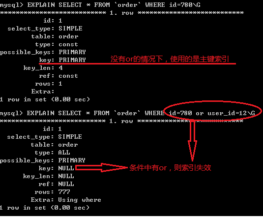
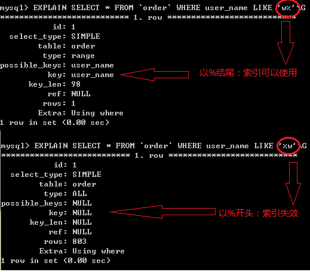
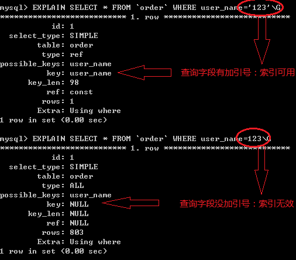

### Mysql索引会失效的几种情况分析

在做项目的过程中，难免会遇到明明给mysql建立了索引，可是查询还是很缓慢的情况出现，下面我们来具体分析下这种情况出现的原因及解决方法
索引并不是时时都会生效的，比如以下几种情况，将导致索引失效：

1. 如果条件中有or，即使其中有条件带索引也不会使用(这也是为什么尽量少用or的原因)
注意：要想使用or，又想让索引生效，只能将or条件中的每个列都加上索引


2. 对于多列索引，不是使用的第一部分，则不会使用索引
　　
3. like查询是以%开头



4. 如果列类型是字符串，那一定要在条件中将数据使用引号引用起来,否则不使用索引



5. 如果mysql估计使用全表扫描要比使用索引快,则不使用索引

### 查看索引的使用情况

```sql
show status like ‘Handler_read%'
```


- handler_read_key:这个值越高越好，越高表示使用索引查询到的次数
- handler_read_rnd_next:这个值越高，说明查询低效